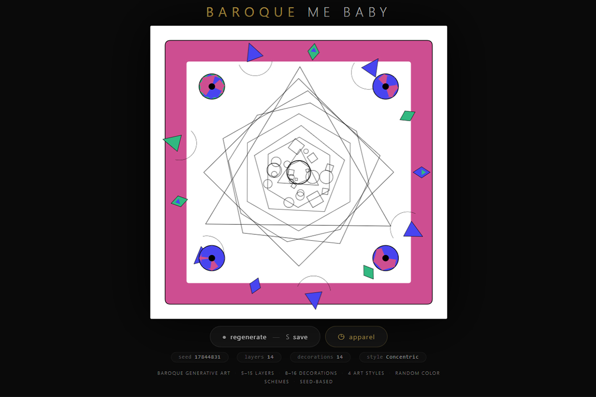
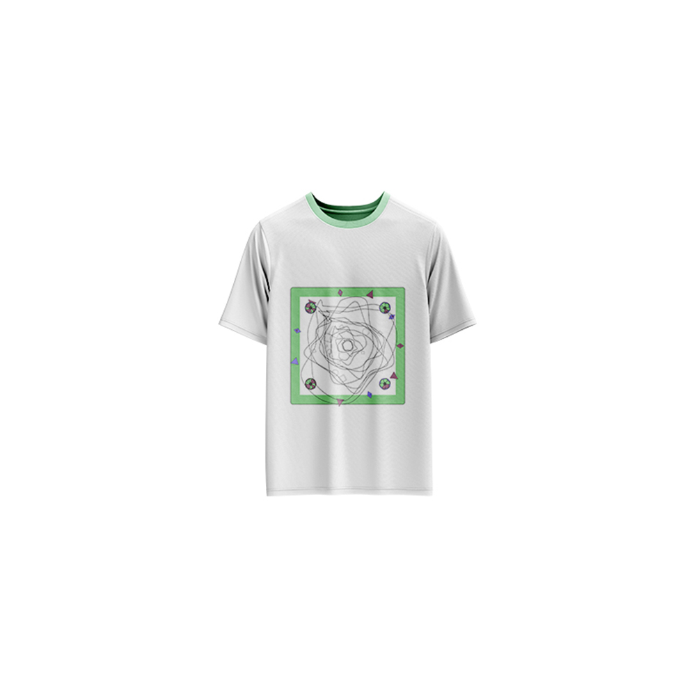

# Baroque Me Baby — Generative Baroque Art

[](https://reyrove.github.io/Baroque-Me-Baby-Generative-Art)
[](https://opensource.org/licenses/MIT)

> **Generative art meets baroque elegance.** Each refresh creates a unique ornate composition with decorative frames, layered geometric patterns, and rich color palettes.

## 🎨 Live Demo

<div align="center">
  <a href="https://reyrove.github.io/Baroque-Me-Baby-Generative-Art" target="_blank">
    
  </a>
  <br><br>
  <a href="https://reyrove.github.io/Baroque-Me-Baby-Generative-Art" target="_blank">
    
  </a>
  <br>
  <em>Click the image or button to experience the generative baroque art</em>
</div>

## 🎯 Features

- **Baroque Aesthetic** — Ornate frames, decorative corner pieces, and intricate patterns
- **4 Art Styles** — Concentric, Radial, Polygonal, and Organic curves
- **Rich Color Palettes** — Randomly generated warm, cool, and balanced schemes
- **Seed-Based** — Every composition is unique and reproducible via its seed
- **Save & Share** — Download as PNG with seed in filename
- **Apparel Mode** — Preview artwork on a T-shirt mockup
- **Responsive** — Works on desktop, tablet, and mobile
- **Keyboard Shortcuts**:
  - `R` — Regenerate
  - `S` — Save image
  - `T` — Toggle apparel view

## 👕 Apparel Preview

<div align="center">
  
  <br>
  <em>Baroque Me Baby artwork printed on a T-shirt</em>
</div>

## 🚀 Quick Start

### Local Development

```bash
# Clone the repository
git clone https://github.com/reyrove/Baroque-Me-Baby-Generative-Art.git

# Navigate to the directory
cd Baroque-Me-Baby-Generative-Art

# Open in browser
open index.html
# or use a live server
```

### Deploy to GitHub Pages

1. Push to GitHub
2. Go to Settings → Pages
3. Select branch `main` and root folder
4. Your site will be live at `https://reyrove.github.io/Baroque-Me-Baby-Generative-Art`

## 🧠 How It Works

The artwork is generated using a deterministic random number generator, seeded by timestamp + random noise. Every refresh:

1. **Frame Generation**:
   - Creates an ornate frame with 8-16 decorative elements
   - Random color scheme from warm, cool, or balanced palettes
   - Corner rosettes with petal patterns

2. **Artwork Generation**:
   - Selects from 4 art styles (Concentric, Radial, Polygonal, Organic)
   - Generates 5-15 layers of increasing complexity
   - Each layer includes random rotations and variations
   - Optional decorative elements throughout

3. **Final Touches**:
   - Center dot completes the composition
   - Clean black linework on white background

## 📁 File Structure

```
Baroque-Me-Baby-Generative-Art/
├── index.html          # Main application (all-in-one)
├── Baroque-Me-Baby.jpg # T-shirt mockup image
├── fav.svg             # Favicon
├── demo-screenshot.jpg # Website demo screenshot
├── README.md           # This file
└── LICENSE             # MIT License
```

## 🛠️ Tech Stack

- **Vanilla HTML/CSS/JS** — No dependencies
- **Canvas API** — 2D rendering
- **CSS Grid & Flexbox** — Responsive layout
- **GitHub Pages** — Hosting

## 🎯 Interactive Controls

| Action | Keyboard | Button |
|--------|----------|--------|
| Regenerate | `R` | Click "regenerate" |
| Save Image | `S` | Click "regenerate" |
| Toggle Apparel | `T` | Click "apparel" |

## 🔧 Customization

You can tweak the generation parameters in `index.html`:

- **Layer count**: Modify `layers` calculation (line ~320)
- **Decoration count**: Adjust `decorationCount` (line ~220)
- **Art styles**: Modify the `artworkType` conditions (line ~335-365)
- **Color palettes**: Edit RGB ranges (line ~165-175)
- **Frame width**: Adjust `frameWidth` calculation (line ~185)

## 📱 Responsive Design

The application automatically adapts to:
- Desktop screens
- Tablets
- Mobile phones
- Landscape orientation
- Various aspect ratios

## 🎨 Design Inspiration

The baroque style is characterized by:
- **Ornate detail** — Rich decorative elements
- **Symmetry** — Balanced, structured compositions
- **Grandeur** — Bold, dramatic visual statements
- **Ornamentation** — Elaborate patterns and flourishes

This generative art piece captures these elements through algorithmic interpretation.

## 🤝 Contributing

Contributions are welcome! Feel free to:
- Fork the repository
- Create a feature branch
- Submit a pull request

## 📄 License

MIT License — see [LICENSE](LICENSE) file for details.

## 🙏 Acknowledgments

- Inspired by Baroque art and architecture
- Designed as generative art for apparel
- Special thanks to the generative art community

---

**Built with ❤️ and baroque flair**